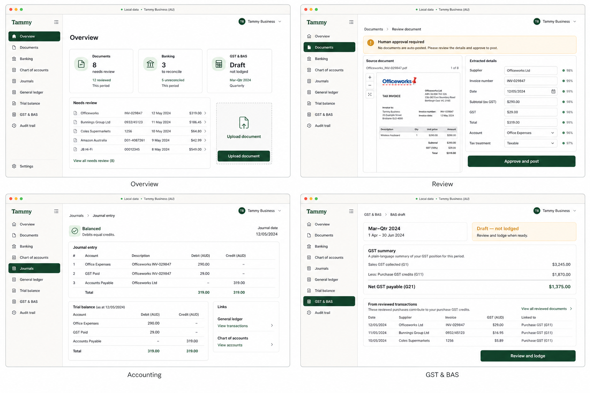

# Tammy Accounting and Tax Walkthrough UI Design

**Status:** Approved interaction design; awaiting independent specification review  
**Date:** 2026-08-09  
**Scope:** First complete packaged-desktop accounting walkthrough  
**Normative parent:** [Core Business Accounting Suite Design](./2026-08-02-core-business-accounting-suite-design.md)

## 1. Purpose

Replace Tammy's diagnostics-only landing page with a simple, working, offline accounting application that a business owner can validate manually from start to finish.

This milestone proves one coherent bookkeeping and Australian GST workflow through the packaged Electron application:

1. create a real blank local workspace or open an explicitly labelled demo business;
2. inspect a usable chart of accounts;
3. import a supplier invoice, receipt, or bank statement from PDF, image, or CSV;
4. extract document data locally, including OCR for scanned pages;
5. require a human to review and correct the extracted values;
6. approve and atomically post a balanced journal;
7. trace that posting through journals, general ledger, trial balance, GST/BAS, and audit history; and
8. close and reopen the packaged app and see the same retained state.

The parent specification remains authoritative for accounting rules, money arithmetic, roles, security, persistence, evidence, audit, idempotency, and later suite breadth. This document fixes the narrower UI, composition, and acceptance contract needed to make the approved walkthrough real.

## 2. Product boundary

### 2.1 Included

- Packaged Electron UI with functional Overview, Documents, Banking, Chart of accounts, Journals, General ledger, Trial balance, GST & BAS, Audit trail, and Settings routes.
- Blank-workspace onboarding and an explicit deterministic demo-workspace option.
- Australian organisation defaults, AUD presentation, non-cash (accrual) GST, and a standard small-business chart template.
- Supplier-contact resolution, one primary financial account, and a verified opening conversion so a blank workspace can complete the workflow without hidden seed data.
- Supplier invoices and receipts from PDF, PNG, and JPEG.
- Bank statements from PDF and CSV.
- Local text extraction, page classification, and OCR fallback with no network dependency.
- Human review and correction before any financial mutation.
- Supplier expense/payables or paid-expense posting with GST.
- Bank-statement staging sufficient to review and reconcile the walkthrough payment.
- Balanced journal, ledger, trial-balance, GST summary, draft BAS workpaper, and audit projections.
- Restart-safe extraction, duplicate detection, cancellation, rollback, and evidence provenance.
- Automated renderer, core integration, and packaged Electron walkthroughs with screenshots and retained traces.

### 2.2 Explicitly excluded from this milestone

- Production ATO or SBR lodgement. The UI must say **Draft — not lodged** and must never imply transmission.
- Live bank feeds, cloud OCR, cloud storage, telemetry, or any hidden network fallback.
- Automatic posting from extraction or confidence scores.
- Payroll, inventory, multi-currency, consolidation, tax advice, or unattended bookkeeping.
- The optional Unlimited-OCR accelerator as a release dependency.
- Completing all later breadth in the parent suite specification. Unimplemented later workflows must not appear as enabled controls or fabricated data.

The walkthrough is a real vertical slice, not a static prototype. Every visible navigation item and primary control in scope must execute a production path or show a truthful empty state with a working next action.

## 3. Approved visual direction

The generated board below is the directional reference for information architecture, density, hierarchy, tone, and the four primary screens. It is not a substitute for domain rules or accessibility requirements.



The interface uses warm off-white surfaces, dark forest green actions, restrained borders, compact tables, readable typography, and no gradients or decorative dashboard clutter. It should feel like dependable desktop bookkeeping software rather than a marketing site.

### 3.1 Interaction principles

- Keep the sidebar task-based and stable between screens.
- Give each screen one visually dominant primary action.
- Use business-owner language first; technical identifiers belong in secondary detail.
- Put the source page beside editable extracted fields.
- Treat confidence as information, never authority.
- Keep source document, review decision, journal, ledger lines, GST facts, and audit event directly traceable.
- Prefer useful empty states over disabled placeholders.
- Preserve visible keyboard focus, semantic headings, labelled inputs, table headers, and status announcements.
- Support the desktop window down to 1024×700 and a compact rail layout below 900 px without hiding essential actions.

## 4. Application structure

### 4.1 App shell

The shell has:

- a fixed left navigation rail;
- a compact top bar showing **Local data**, the active business, and a workspace menu;
- a single scrollable main region;
- route-level loading, empty, ready, and recoverable-error states; and
- a persistent offline/private indicator that does not consume the primary content area.

The sidebar order is:

1. Overview
2. Documents
3. Banking
4. Chart of accounts
5. Journals
6. General ledger
7. Trial balance
8. GST & BAS
9. Audit trail
10. Settings

Navigation uses a renderer-owned router. Reload and deep navigation restore the current route without bypassing workspace authentication. Unknown routes return to Overview with a non-disruptive notice.

### 4.2 Startup and onboarding

When no workspace exists, the user sees two clear choices:

- **Create my workspace** — the default production path; or
- **Open demo business** — creates a separately labelled deterministic sample workspace through the same public commands used by production.

Blank setup collects business name, ABN when known, financial-year end, GST registration date, reporting frequency, administrator credentials, and the primary bank account's display name, opening date, and opening balance. This milestone is explicitly non-cash (accrual) GST; the setup explains that basis and does not present an unsupported cash-basis choice. Setup installs the Australian chart template, maps the financial account to its ledger account, posts a verified opening conversion (a zero balance is valid), and opens the Overview. Optional sample data is an explicit unchecked choice and can never be silently added to a real workspace.

The demo path must show **Demo data** in the top bar and Settings, must use no production customer information, and must be disposable without affecting another workspace. Demo creation is idempotent and uses normal domain services, not direct database inserts.

Existing locked or unauthenticated workspaces show unlock/sign-in before business routes. Diagnostics remain available under Settings; they no longer block navigation after the core is ready.

## 5. Screen contracts

### 5.1 Overview

Overview answers “what needs my attention?” and displays real projections only:

- Documents needing review and reviewed this period;
- Banking lines needing reconciliation and unreconciled this period;
- GST/BAS status and period;
- a short **Needs review** queue linking to the exact item; and
- one **Upload document** primary action.

The blank state explains the three-step workflow—upload, review, post—and offers the same upload action. Counts update after commands without requiring an app restart.

### 5.2 Documents

The document list supports status, type, date, supplier, amount, and pagination. Its primary action is **Upload document**. Drag-and-drop and the file picker accept only supported bounded files and show validation before creating a job.

Status is one of uploading, extracting, waiting for password, needs review, ready to post, posted, cancelled, failed retryable, or failed terminal. A duplicate presents the existing source and does not create another accounting effect.

The candidate-review screen follows the approved split view:

- left: original page preview with page controls and source highlights;
- right: editable supplier, invoice/reference, dates, lines, subtotal, GST, total, account, and tax treatment;
- top: truthful job/review status and a human-approval notice;
- bottom: one **Save review** action.

The reviewer can reject a candidate, correct it, resolve or create the supplier through a compact `ContactService.CreateContact` dialog, choose the target kind, or cancel. Arithmetic, GST, required-field, duplicate, and posting-date errors appear next to the relevant fields. `Save review` seals an immutable review and has no accounting effect.

After saving, a separate handoff screen shows the sealed source decisions and offers one **Create bill draft** action. That calls `DocumentService.CreateTargetDraft`. The resulting purchase draft is editable only through the purchase workflow and has a separate **Approve bill** action using `PurchasesService.ApproveBill`. A paid receipt instead creates a spend-money draft and uses the separate **Confirm cash transaction** action. The approved wireframe's former “Approve and post” label is therefore refined into these explicit steps; no document is auto-posted and no confidence score can bypass them.

### 5.3 Banking

Banking shows financial accounts, imported statements, staged lines, matches, payments, and reconciliations. Its primary action is **Import statement**. The walkthrough supports CSV and extracted PDF statements through the same staging model. The primary account and its opening conversion are created during onboarding; Settings exposes a reasoned opening-conversion replacement workflow before later dependencies exist.

The user confirms the account, date/amount mapping, sign convention, statement range, opening/closing balances, and duplicates before committing the import. A posted bill still represents a payable, not a payment. For its withdrawal line the user explicitly selects **Create supplier payment**, which calls `SettlementService.RecordSupplierPayment` with the bill allocation and posts debit payables/credit bank. A subsequent **Confirm match** action calls `BankingService.ConfirmMatch`; it links the immutable statement line and payment without another journal.

Matching and reconciliation remain different states. A fully matched line is not called reconciled. The Reconcile view separately creates a draft with `BankingService.CreateReconciliation`, lets the user confirm the included lines and balances with `UpdateReconciliation`, and exposes **Complete reconciliation** only when the parent equations produce zero difference and every included line is matched or explicitly excluded. `CompleteReconciliation` records the immutable completed period. The UI uses `unmatched/part matched/fully matched` for match state and `not reconciled/draft/completed` for reconciliation state.

### 5.4 Chart of accounts

The chart lists code, name, type, tax default, balance, designation, and status. The installed template is immediately usable. The primary action is **New account**. Ordinary accounts can be created, edited, archived, and restored subject to the parent specification; system/control accounts are visibly protected.

### 5.5 Journals

The list displays date, reference, source, state, debit, and credit totals. Selecting a journal opens the approved balanced-entry view with source links and the linked trial-balance snapshot. The primary action is **New manual journal**.

Manual journals require at least two lines, exact debit/credit equality, an open period, and explicit confirmation. Posted journals are immutable. Reversal is a separate reasoned action and retains both entries.

### 5.6 General ledger

The ledger supports account, date, source, and pagination filters. Each movement links back to its journal and, when applicable, its document and review. Running and period balances use core projections; the renderer never calculates authoritative balances.

### 5.7 Trial balance

The trial balance shows account code/name, debit, credit, and totals at an as-of date. Debit and credit totals must agree before the view is marked balanced. Rows link to filtered ledger detail. CSV export is local and uses an approved destination.

### 5.8 GST & BAS

The screen presents a reporting period, a clear **Draft — not lodged** status, GST collected, purchase credits, net payable/refundable, and source transaction lines. Values come from retained tax facts, not renderer arithmetic. Each row links back to the document, journal, and tax evidence.

The primary action is **Create BAS workpaper** or, when one exists, **Review BAS draft**. `TaxService.CreateBASWorkpaper` pins the revision vector, `TaxService.ValidateBAS` records local validation without changing calculated values, and `TaxService.ExportBAS` writes a local workpaper through the approved destination boundary. This milestone does not expose `AcceptDeclaration`, Lodge, Prepare submission, or Submit controls.

### 5.9 Audit trail

The audit list provides time, actor, action, object, outcome, and paginated detail. Entries link to public business objects without exposing secrets or private commitment openings. A **Verify integrity** action runs the production chain verifier and reports the verified generation, sequence, and head. Evidence export remains an explicit secondary action using the approved-destination boundary.

### 5.10 Settings

Settings shows workspace/business identity, demo status, GST settings, local data location as a safe display label, diagnostics, and lock/sign-out actions. Security-sensitive changes reuse existing authenticated workspace and organisation commands. There is no generic filesystem browser or arbitrary path field.

## 6. Data and process architecture

### 6.1 Protobuf is the source of truth

All business commands, queries, events, job states, filters, cursors, evidence references, and error details are defined in `proto/tammy/v1/*.proto`, linted and generated by Buf. The renderer imports generated TypeScript. The Go core implements generated Connect service interfaces. No parallel handwritten DTO, generic JSON RPC, or test-only IPC tunnel is allowed.

The parent service ownership is retained exactly. The walkthrough composes the existing Workspace, Identity, Organisation, Accounting, and Audit services with the parent-defined Contact, Purchases, Settlement, Document, Banking, Reporting, and Tax services:

- `DocumentService`: `IngestDocument`, `ProvidePdfPassword`, `CancelExtraction`, `RetryExtraction`, `SaveReview`, `CreateTargetDraft`, `SupersedeDocumentReview`, and explicit get/list queries;
- `ContactService`: supplier creation/resolution and explicit get/list queries;
- `PurchasesService`: bill-draft update/cancel, `ApproveBill`, and explicit get/list queries;
- `SettlementService`: `RecordSupplierPayment`, allocation queries, and reversal only through the parent dependency rules;
- `BankingService`: financial-account, statement-staging/commit, match, and reconciliation commands and explicit queries;
- `ReportingService`: financial report generation/export only; and
- `TaxService`: `CreateBASWorkpaper`, `ValidateBAS`, and `ExportBAS` for the local draft workflow.

The only focused public projection not already owned by the parent catalogue is the Overview attention summary:

| RPC | Role | Request → result | Version/idempotency | Principal failures |
|---|---|---|---|---|
| `OverviewService.GetAttentionSummary` | any accounting-read role | organisation ID, civil as-of date, requested reporting period → bounded document, banking, and BAS attention counts plus at most eight typed item links | query; no operation key; result pins the current financial revision and bounded module revisions | authentication/permission denied, invalid organisation/date/period, revision snapshot unavailable |

The Overview service is a read-only composition over documented module read ports. It owns no accounting tables, cannot mutate attention state, and returns typed resource references rather than renderer routes or display-only IDs.

Service methods are named and task-specific. Every mutating request carries the established authenticated command context, operation key, and expected version/revision required by the parent specification. List methods use bounded stable cursors.

### 6.2 Desktop boundary

Electron main owns core lifecycle and the generated Connect client. Preload exposes a frozen list of named, typed methods corresponding to production RPCs. Renderer access remains isolated: no Node globals, raw file paths, database handles, generic RPC invocation, or arbitrary IPC channels.

File selection returns an approved opaque file capability. Main streams bounded bytes to the core/helper and never gives a renderer-selected path to a privileged service. Exports use the existing approved-destination pattern.

### 6.3 Local extraction

The first-stage local helper uses the parent specification's length-delimited Protobuf protocol and sandbox limits:

```text
approved local file capability
  → retain encrypted original and SHA-256 identity
  → validate magic bytes, size, and page limits
  → firecrawl/pdf-inspector classifies pages and extracts positioned text
  → scanned/image pages render in the sandbox
  → bundled lightweight OCR produces positioned words/confidence
  → deterministic field candidates and source coordinates
  → persisted review draft
  → explicit human approval
  → one atomic accounting transaction
```

The bundled lightweight OCR runtime is the required offline default. `baidu/Unlimited-OCR` may later be an optional, user-installed accelerator behind the same typed provider interface when compatible GPU/runtime checks pass. Its absence, model failure, or incompatibility must never break the default path, weaken sandboxing, trigger network use, or change approval rules.

Text PDF, scanned PDF, mixed PDF, PNG, JPEG, and statement CSV fixtures must be deterministic and redistributable. Extraction engine name/version, original hash, coordinates, confidence, edits, and final target references are retained as evidence.

### 6.4 State flow

Extraction, review, target creation, and source posting are deliberately separate lifecycles:

```text
RETAINED → QUEUED → EXTRACTING → CANDIDATE_READY
                         ├→ WAITING_FOR_PASSWORD
                         ├→ FAILED_RETRYABLE → QUEUED
                         ├→ FAILED_TERMINAL
                         └→ CANCELLED

CANDIDATE_READY → REVIEW_SEALED
REVIEW_SEALED → TARGET_DRAFT_CREATED
bill DRAFT → APPROVED | CANCELLED
cash draft DRAFT → POSTED | CANCELLED
```

`DocumentService.SaveReview` seals candidate decisions and has no accounting effect. `DocumentService.CreateTargetDraft` is a separate idempotent command and has no ledger effect. The sealed review never becomes editable; a permitted change creates a linked superseding review under the parent rules. The resulting bill or cash draft may be edited through its owning source workflow while retaining the sealed-review comparison.

Only source-specific approval/confirmation changes accounting. `PurchasesService.ApproveBill` or `BankingService.ConfirmCashTransactionDraft` runs in one encrypted SQLite write transaction and either commits all of the following or none:

- approved supplier bill/payable or posted paid-expense source;
- balanced journal and lines;
- retained GST facts;
- sealed-review, draft, source, and journal provenance;
- audit event and idempotency result.

If posting fails, the source draft remains available for correction and retry while the sealed review remains immutable; no partial ledger, GST, match, or audit success is visible. Replaying the same semantic approval with the same operation key returns the same result. A changed request conflicts. Supplier payment/allocation, statement match, and reconciliation are later explicit commands with their own atomic boundaries and audit events.

## 7. Security and privacy

- The packaged walkthrough works with outbound network denied and `navigator.onLine === false`.
- Original documents, derivatives, database state, and job records remain encrypted at rest under the workspace boundary.
- OCR and parsing receive no workspace key, database handle, user session, arbitrary source path, or unrestricted destination.
- Temporary extraction material uses private random directories, is bounded, and is removed on success, failure, cancellation, and restart recovery.
- Password-protected PDF passwords remain memory-only, are never logged/audited/idempotency-normalised, and follow the parent attempt limits.
- Renderer previews use bounded opaque capabilities or bytes and cannot navigate the local filesystem.
- Roles and permissions are enforced in the core, not inferred from hidden UI controls.
- Logs and error surfaces contain typed codes and safe context, not document contents, passwords, private keys, or raw paths.

## 8. Error and recovery behaviour

Unsupported, corrupt, oversized, recursive, malformed, password-protected, and duplicate inputs fail before any accounting mutation. Errors explain the safe next action: choose another file, provide password, retry extraction, resume review, or inspect the existing duplicate.

Extraction jobs are restart-safe and cancellable before review. On process restart, retained jobs resume from a durable safe state; untrusted temporary output is discarded. Cancellation cannot race through the approval commit point.

Low-confidence candidates are highlighted and editable. Missing evidence, GST arithmetic mismatch, closed period, archived account, stale version, duplicate invoice reference, and unbalanced posting prevent approval with field-level guidance.

Operational failures use a route-level retry while preserving user edits where safe. Fatal core/workspace failures show a recovery screen rather than a blank window. Every screen must have a tested empty, loading, populated, recoverable-error, and permission-denied state where applicable.

## 9. Automated validation

### 9.1 Test layers

- Pure accounting and GST tests for exact money, balancing, source posting, reversal, and BAS aggregation.
- Protobuf/Protovalidate/Buf tests for every new message, transition, bound, and generated client.
- SQLCipher repository, migration, constraint, idempotency, rollback, restart, and concurrent approval tests.
- Rust/native-helper parser tests for text, scanned, mixed, rotated, corrupt, encrypted, and hostile documents.
- Renderer tests for routing, keyboard navigation, accessibility names, focus, forms, tables, empty/loading/error states, and no renderer-side authoritative arithmetic.
- Main/preload tests proving the exact named API, capability isolation, file bounds, and absence of generic channels.
- Packaged Electron Playwright tests using the real generated client, Go core, encrypted SQLite, local helper, and production renderer.

### 9.2 Required packaged walkthroughs

The packaged test suite must perform visible UI actions and retain screenshot, video-on-failure, and trace artifacts:

1. create a blank workspace, finish setup, and verify an empty but usable Overview;
2. create/open the demo workspace and verify its label and deterministic summary;
3. upload and extract a native-text supplier invoice PDF while all network access is denied;
4. upload a scanned PDF and image receipt and prove local OCR fallback;
5. review the source beside fields, create/resolve the supplier, correct at least one candidate, seal the review, create a bill draft, and separately approve it;
6. verify the balanced bill journal, ledger movement, trial balance, GST purchase credit, BAS draft, and linked audit events;
7. import a bank CSV and extracted PDF statement, review signs/duplicates, separately create and allocate the supplier payment, confirm its match, and complete the first reconciliation;
8. close and reopen the app and verify persisted objects and balances;
9. cancel an extraction after durable queueing and prove no plaintext orphan or financial mutation;
10. reject corrupt, oversized, unsupported, duplicate, and wrong-password inputs without accounting effects;
11. inject a posting failure and prove atomic rollback while the reviewed draft remains available;
12. run the primary workflow using only keyboard navigation and check for renderer exceptions, console errors, uncaught page errors, and accessibility violations.

Tests assert the same amounts through independent public projections: document review, journal, ledger, trial balance, GST detail, BAS workpaper, banking match, and audit history. Direct database fixture mutation is forbidden outside repository/migration corruption tests.

The descriptor-derived `test/e2e/coverage.yaml` and transition catalogue are updated with each production RPC before the milestone is complete. `pnpm contracts:production`, packaged E2E, default and SQLCipher-tagged Go tests, race tests, vet, TypeScript typecheck/lint/unit tests, helper tests, and generated-tree stability are release gates.

### 9.3 Deterministic accounting oracle

The primary blank-workspace and demo-workspace tests use the same exact synthetic facts. The demo path creates them through public production commands and labels them demo data; it does not insert rows directly.

| Fact | Exact value |
|---|---|
| Organisation | `Tammy Demo Pty Ltd` with a clearly synthetic test ABN |
| GST profile | AUD, non-cash/accrual GST, quarterly, 30 June year end |
| BAS period | 1 April 2024 through 30 June 2024 |
| Primary bank | Business Bank, asset account, opening date 30 April 2024, opening ledger and statement balance `$1,000.00` |
| Supplier | `Paper & Co Supplies Pty Ltd`, supplier contact created/resolved before the bill draft |
| Source document | `paper-and-co-sup-1001.pdf`, issued 12 May 2024, tax exclusive |
| Bill line | Office supplies net `$290.00`, GST `$29.00`, gross `$319.00` |
| Statement | 1–31 May 2024, one withdrawal on 15 May for normalized ledger amount `-$319.00`, closing balance `$681.00` |
| Payment | Supplier payment on 15 May 2024 for `$319.00`, fully allocated to bill `SUP-1001` |

The exact retained journals are:

```text
Opening conversion, 30 Apr 2024
  Dr Business Bank                 1,000.00
  Cr Opening Balance Equity        1,000.00

Bill approval, 12 May 2024
  Dr Office Supplies Expense         290.00
  Dr Current GST Receivable            29.00
  Cr Accounts Payable                 319.00

Supplier payment, 15 May 2024
  Dr Accounts Payable                 319.00
  Cr Business Bank                    319.00
```

After payment, the trial balance shows debit Business Bank `$681.00`, debit Office Supplies Expense `$290.00`, debit Current GST Receivable `$29.00`, credit Opening Balance Equity `$1,000.00`, and zero Accounts Payable; total debits and credits are each `$1,000.00`.

The completed reconciliation proves both `$1,000.00 + (-$319.00) = $681.00` statement movement and `$1,000.00 + (-$319.00) = $681.00` newly cleared ledger movement, with balanced match components and no unmatched included line.

The non-cash BAS workpaper reports `G1 $0.00`, `1A $0.00`, `1B $29.00`, and net GST refundable `$29.00`, linked to the bill's retained purchase tax fact. Payment allocation must not recognize GST a second time. The Overview starts with one review item after the fixture is extracted and ends with zero document-review items, zero unmatched statement lines, a completed reconciliation, and one current draft BAS workpaper. Exact counts and resource links are asserted, not snapshot text alone.

## 10. Implementation sequence

Implementation is split into independently verifiable vertical increments, but no increment may ship a fake enabled control:

1. Replace the diagnostics landing page with the accessible app shell, routes, real workspace onboarding, and blank/demo Overview.
2. Complete the existing accounting kernel composition and expose chart, opening conversion, manual journals, ledger, and trial balance through named preload methods.
3. Add the parent contact/purchases boundaries needed for supplier resolution and an editable non-posting bill draft.
4. Add document/evidence Protobuf contracts, encrypted persistence, restart-safe job lifecycle, and list/detail UI.
5. Package the local PDF classification/text helper and lightweight OCR provider, then connect candidate extraction to the review/sealed-review/target-draft UI.
6. Implement source-specific bill/cash-draft approval with GST and end-to-end provenance, preserving the separate review and target commands.
7. Add the primary financial-account setup, statement staging, supplier payment/allocation, matching, and first-reconciliation workflow.
8. Add GST detail, `TaxService` draft BAS workpaper, audit trace links, Settings/diagnostics, exports, and recovery states.
9. Harden all paths with hostile-document, rollback, restart, offline, accessibility, and packaged walkthrough gates.

Proto changes and generated artifacts land with the increment that first uses them. Each increment begins with failing contract/domain/UI/E2E coverage and ends with focused and affected-suite verification.

## 11. Completion criteria

This walkthrough milestone is complete only when:

- the diagnostics-only landing page and disabled setup control are gone;
- every scoped sidebar item opens a real screen with a working primary action or truthful actionable empty state;
- both blank and demo workspaces work in the packaged app;
- a blank workspace can create/resolve its supplier and has a valid primary financial account and opening conversion before document payment or reconciliation;
- native and scanned documents reach an editable review using only local extraction;
- no confidence score or extraction path can post automatically;
- review sealing, target-draft creation, and bill approval are separate explicit commands, and only bill approval produces a balanced, traceable journal and GST fact atomically;
- supplier payment/allocation, bank statement import, match confirmation, and reconciliation completion work as distinct UI states and commands;
- journal, ledger, trial balance, GST/BAS, and audit projections cross-reconcile;
- BAS is always presented as a local draft and never as lodged;
- restart, duplicate, cancellation, password, extraction failure, and posting rollback behaviours pass;
- all renderer/preload/core/helper boundaries remain typed Protobuf/Buf contracts with no generic tunnel;
- the packaged Electron automated walkthrough passes offline and produces reviewable visual artifacts; and
- the user can repeat the primary workflow manually without hidden setup or developer-only commands.
